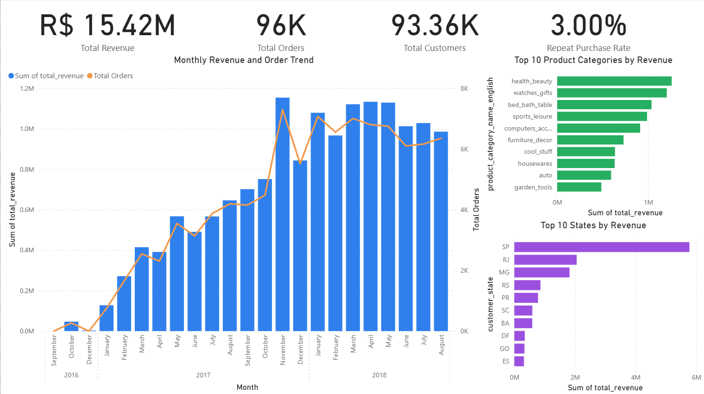
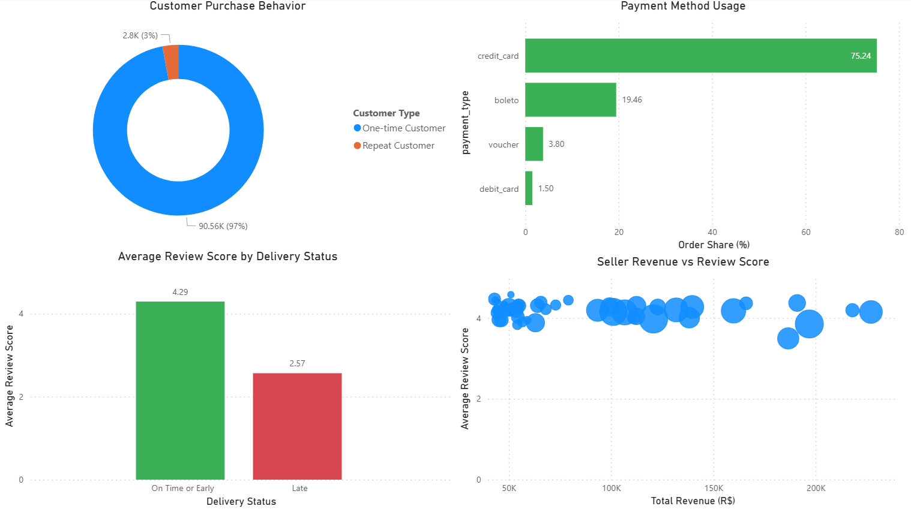

# Olist E-Commerce Customer & Sales Analytics

## Project Overview

This project analyzes the Brazilian Olist e-commerce dataset to understand sales performance, customer purchasing behavior, payment preferences, delivery performance, customer satisfaction, and seller quality.

The project follows an end-to-end data analytics workflow using Python, SQL Server, and Power BI. The final objective is to transform raw transactional data into business insights and actionable recommendations that may help improve revenue, customer retention, delivery performance, and seller quality.

## Business Questions

The analysis addresses the following questions:

1. How do revenue and order volume change over time?
2. Which product categories generate the most revenue?
3. Which Brazilian states contribute the most revenue?
4. What percentage of customers make repeat purchases?
5. Which payment methods are used most frequently?
6. How does delivery performance affect review scores?
7. Which sellers generate high revenue but receive poor customer ratings?
8. What actions can Olist take to improve revenue and customer retention?

## Tools and Technologies

* **Python:** Pandas, NumPy, Matplotlib and Seaborn
* **SQL Server:** Data querying and business analysis
* **Power BI:** Data modeling, DAX measures and interactive dashboards
* **Jupyter Notebook:** Data exploration, cleaning and analysis
* **Visual Studio Code:** Project organization and documentation

## Dataset

The project uses the Brazilian E-Commerce Public Dataset by Olist.

The dataset contains information about:

* Customers
* Orders
* Order items
* Products
* Sellers
* Payments
* Reviews
* Product category translations
* Customer and seller locations

Dataset source: [Brazilian E-Commerce Public Dataset by Olist](https://www.kaggle.com/datasets/olistbr/brazilian-ecommerce)

## Project Structure

```text
ECOMMERCE OLIST ANALYSIS/
├── data/
│   ├── raw/
│   └── processed/
├── images/
│   ├── sales_overview.png
│   └── customer_operations.png
├── notebooks/
├── powerbi/
├── sql/
└── README.md
```

## Data Preparation

The data preparation process included:

* Loading and inspecting nine related CSV tables
* Checking table dimensions, data types and primary keys
* Identifying missing values and duplicated records
* Validating relationships between customers, orders, products and sellers
* Standardizing date columns
* Removing duplicate geolocation records
* Preserving important data-quality issues using flags instead of silently removing records
* Filtering delivered orders for revenue, customer, delivery and review analysis
* Creating processed summary tables for SQL Server and Power BI

For customer-level analysis, `customer_unique_id` was used instead of `customer_id`, because one customer may have multiple order-level customer IDs.

Revenue in this project is defined as the sum of item prices from delivered orders.

## Analysis Workflow

### 1. Python Analysis

Python was used to:

* Explore and clean the raw datasets
* Validate table relationships
* Create analysis-ready datasets
* Calculate business metrics
* Analyze monthly sales trends
* Compare product categories and regions
* Calculate repeat-purchase behavior
* Analyze payment-method usage
* Compare delivery performance with review scores
* Evaluate seller revenue and customer ratings

### 2. SQL Server Analysis

Seven SQL business queries were created:

1. Monthly revenue and order trend
2. Product categories by revenue
3. State-level sales performance
4. Repeat-purchase rate
5. Payment-method usage
6. Delivery performance and review scores
7. High-sales sellers with poor ratings

Advanced SQL techniques used in the project include:

* Common Table Expressions
* Multiple-table joins
* Conditional aggregation
* Distinct customer and order counts
* Window functions
* `PERCENTILE_CONT`
* Business-rule filtering

### 3. Power BI Dashboard

Two Power BI dashboard pages were created:

* **Sales Overview**
* **Customer & Operations**

## Dashboard Preview

### Sales Overview



### Customer & Operations



## Key Results

### Sales Performance

* Delivered orders analyzed: **96,478**
* Total revenue: approximately **R$15.42 million**
* Unique customers: **93,358**
* Order volume and revenue have a very strong positive relationship, with a correlation of approximately **0.996**
* São Paulo contributes approximately **37.41%** of total revenue, indicating a strong geographic concentration

### Customer Retention

* Repeat customers: **2,801**
* Repeat-purchase rate: approximately **3.00%**
* Approximately **97%** of customers purchased only once

The low repeat-purchase rate indicates that customer retention is one of the largest opportunities for business improvement.

### Payment Methods

Payment-method usage by order share:

* Credit card: **75.24%**
* Boleto: **19.46%**
* Voucher: **3.80%**
* Debit card: **1.50%**

Credit cards dominate customer payments, suggesting that installment options and credit-card checkout performance are important to the purchasing experience.

### Delivery and Customer Satisfaction

* Average review score for orders delivered on time or early: **4.29**
* Average review score for late deliveries: **2.57**

Late deliveries are strongly associated with lower customer ratings. This relationship is observational and does not by itself prove causation, but it indicates that delivery performance is an important driver of customer satisfaction.

### Seller Performance

Sellers were classified as high-revenue sellers when their revenue was at or above the 75th percentile.

The high-revenue threshold was approximately **R$3,501.74**.

The analysis identified several sellers with high revenue but average review scores below 3.5. For example, one seller generated approximately **R$38,990.72** in revenue from 187 orders but received an average review score of only **2.79**.

These sellers represent a business risk because poor customer experiences from high-volume sellers may negatively affect customer retention and Olist's overall reputation.

## Business Recommendations

### 1. Improve Customer Retention

Olist should introduce retention initiatives for first-time customers, such as:

* Personalized product recommendations
* Second-purchase discount campaigns
* Loyalty rewards
* Post-purchase email campaigns
* Targeted vouchers based on previous purchases

Because only approximately 3% of customers purchased more than once, even a small improvement in repeat purchasing could create meaningful additional revenue.

### 2. Reduce Late Deliveries

Olist should monitor delivery performance by seller, carrier, product category and region.

Recommended actions include:

* Creating early-warning alerts for orders likely to be delayed
* Reviewing logistics partners with consistently poor performance
* Improving estimated delivery-date accuracy
* Prioritizing operational improvements in regions with frequent delays
* Notifying customers proactively when delays occur

### 3. Monitor High-Revenue Sellers with Poor Ratings

High-revenue sellers with low ratings should be placed in a seller-quality improvement program.

Possible actions include:

* Reviewing product quality and listing accuracy
* Monitoring cancellation, return and complaint rates
* Investigating delivery and packaging performance
* Providing seller training
* Applying performance requirements to sellers with repeated customer complaints

### 4. Optimize Payment Experience

Because credit cards account for more than 75% of payment usage, Olist should maintain a reliable credit-card checkout process and provide clear installment options.

At the same time, boleto remains important and should continue to be supported for customers who prefer alternative payment methods.

### 5. Reduce Geographic Concentration Risk

São Paulo accounts for a large share of revenue. Olist should maintain its strong position in São Paulo while exploring growth opportunities in other high-potential states through:

* Regional promotions
* Local seller acquisition
* Improved delivery coverage
* State-specific product campaigns

## Limitations

* The dataset represents historical Olist transactions and may not reflect current market conditions.
* Revenue is calculated from item prices and does not represent profit.
* Customer retention is measured using completed delivered orders.
* Delivery and review analysis identifies associations, not causal relationships.
* Some orders contain missing operational dates and were excluded from calculations that required those fields.
* Seller ratings with very few reviewed orders can be unstable, so minimum review-count filters were applied where appropriate.

## Conclusion

The analysis shows that Olist generated strong sales volume but faced challenges in customer retention, delivery performance and seller quality.

The most important opportunities are:

1. Increasing the repeat-purchase rate
2. Reducing late deliveries
3. Monitoring high-revenue sellers with poor ratings
4. Improving customer experience after the first purchase
5. Expanding growth beyond the most revenue-concentrated regions

This project demonstrates an end-to-end data analytics workflow using Python, SQL Server and Power BI to transform raw e-commerce data into actionable business recommendations.
